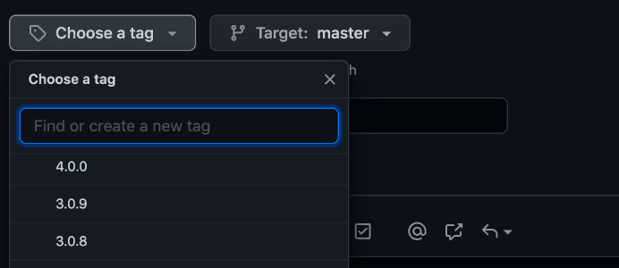

# Prerequisites

Make sure you have installed [Node.js](https://nodejs.org/) 16.x or greater and [npm](https://docs.npmjs.com/cli/v7/configuring-npm/install#using-a-node-version-manager-to-install-nodejs-and-npm).

We use the `grunt` task runner, so install [grunt-cli](https://www.npmjs.com/package/grunt-cli) globally.

    npm install -g grunt-cli

If you do not install **grunt-cli** globally, you'll need to use the full path to the local `grunt` command:

    ./node_modules/.bin/grunt

# Download the Source and Install Dependencies

```
git clone git@github.com:0xfe/vexflow.git
cd vexflow
npm install
```

# Build

Build all libraries (production, debug, and tests):

    grunt

Clean the `build/` and `reference/` folders::

    grunt clean

# Test

Run tests on the command line:

    grunt test

To run tests in the browser, open `tests/flow.html` in a new browser tab. This will load the CJS version of VexFlow, from `vexflow/build/cjs/vexflow-debug-with-tests.js`. You can also try the following commands:

```sh
# Open the default browser to the flow.html test page.
grunt test:browser:cjs

# Open the default browser to `http://localhost:8080/tests/flow.html?esm=true`.
# A web server needs to be serving the `vexflow/` directory (e.g., `npx http-server`).
grunt test:browser:esm
```

Don't forget the [Visual Regression Tests](./Visual-Regression-Tests):

```sh
# reference images will be generated from the last known good build.
git checkout master

# builds vexflow and copies the build output into the reference/ directory.
grunt reference

git checkout <my-feature-branch>

# builds the feature branch and does a visual diff against the version in the reference/ directory.
npm run test:reference
```

## Watch mode

To watch source files and build automatically when a file changes:

```
grunt watch
```

# Publish with [release-it](https://www.npmjs.com/package/release-it)

We use [release-it](https://www.npmjs.com/package/release-it) to streamline the process of publishing to [npm](https://www.npmjs.com/package/vexflow?activeTab=versions) and [GitHub](https://github.com/0xfe/vexflow/releases).

To release a new version, run the following command:

```
grunt release
```

Answer each question (or hit ENTER to accept the default). You will need to provide a one time password (2FA) to publish to npm.

```
🚀 Let's release vexflow (currently at 4.0.0)

? Select increment (next version): patch (4.0.1)
✔ echo add build/ folder
✔ git add -f build/
✔ git commit -m 'Add build/ for the release.'

? Publish vexflow to npm? Yes
? Please enter OTP for npm: __YOUR_ONE_TIME_PASSWORD__
? Commit (release vexflow version 4.0.1)? Yes
? Tag (4.0.1)? Yes
? Push? Yes
? Create a release on GitHub (Release 4.0.1)? Yes
✔ echo Successfully released vexflow 4.0.1 to https://github.com/0xfe/vexflow
✔ echo remove build/ folder
✔ git rm -r build/
✔ git commit -m 'Remove build/ after releasing version 4.0.1.'
🔗 https://www.npmjs.com/package/vexflow
🔗 https://github.com/0xfe/vexflow/releases/tag/4.0.1
🏁 Done
```

## Pre-release: alpha | beta | rc

`grunt release` accepts a pre-release tag as an argument:

```
GITHUB_TOKEN=XYZ grunt release
GITHUB_TOKEN=XYZ grunt release:alpha
GITHUB_TOKEN=XYZ grunt release:beta
GITHUB_TOKEN=XYZ grunt release:rc
```

Add `dry-run` to walk through the steps without actually publishing anything:

```
GITHUB_TOKEN=XYZ grunt release:dry-run
GITHUB_TOKEN=XYZ grunt release:dry-run:alpha
GITHUB_TOKEN=XYZ grunt release:dry-run:beta
GITHUB_TOKEN=XYZ grunt release:dry-run:rc
```

You can run a pre-release multiple times, and it will increment the pre-release number.

```
4.1.0-alpha.1  =>  4.1.0-alpha.2
```

## Release to GitHub Automatically

By default, `grunt release` will open a browser to the GitHub release page where you can customize the text before submitting.

To automate this step, you need a personal access token with **repo** rights.

Generate one here: https://github.com/settings/tokens/new?scopes=repo&description=release-it

Then, to release a new version, run the following command on a single line:

```
GITHUB_TOKEN=__PERSONAL_ACCESS_TOKEN__   grunt release
```


# Publish Manually to npm and GitHub

Show the current VexFlow version:

```
npm version
```

Increment the version in `package.json` WITHOUT committing a new git tag (`--git-tag-version=false`).

Choose one of the following:

```sh
# patch revision: X.Y.0 => X.Y.1
npm version patch --git-tag-version=false
# minor revision: X.1.Z => X.2.0
npm version minor --git-tag-version=false
# major revision: 4.Y.Z => 5.0.0
npm version major --git-tag-version=false

# Use a pre-release tag (alpha | beta | rc) and increment the number after the pre-release tag.
# e.g.: 4.0.1-alpha.0 => 4.0.1-alpha.1
npm version prerelease --preid=alpha --git-tag-version=false
npm version prerelease --preid=beta  --git-tag-version=false
npm version prerelease --preid=rc    --git-tag-version=false

# Use a pre-release tag (alpha | beta | rc) and increment the patch | minor | major version number.
# e.g.: 4.0.1-alpha.W => 4.0.2-alpha.0
npm version prepatch   --preid=alpha --git-tag-version=false
npm version prepatch   --preid=beta  --git-tag-version=false
npm version prepatch   --preid=rc    --git-tag-version=false

# e.g.: 4.0.Z-alpha.W => 4.1.0-alpha.0
npm version preminor   --preid=alpha --git-tag-version=false
npm version preminor   --preid=beta  --git-tag-version=false
npm version preminor   --preid=rc    --git-tag-version=false

# e.g.: 4.Y.Z-alpha.W => 5.0.0-alpha.0
npm version premajor   --preid=alpha --git-tag-version=false
npm version premajor   --preid=beta  --git-tag-version=false
npm version premajor   --preid=rc    --git-tag-version=false
```

Build VexFlow for production. Add the `build/` directory to the repository. Commit and tag this release.

```sh
grunt
git add -f build/
git add package*.json
VEX_VER=$(node -p "require('./package.json').version")
git commit -m "Release version: $VEX_VER"
git tag $VEX_VER
```

## Publish to npm

```sh
npm login

# Publish to 'latest' so that 'npm install vexflow' will get this version.
npm publish

# Publish with a pre-release tag. Example: npm install vexflow@beta will download the version published with --tag beta.
npm publish --tag rc
npm publish --tag beta
npm publish --tag alpha
```

## Release to GitHub

Push the git tag of the build we are releasing. For example, if the tag is `4.0.0`:

```sh
git push origin 4.0.0
```

Create a GitHub release from the tag we just pushed.

If you have the [GitHub CLI](https://cli.github.com/) installed:

```sh
# Create a release from the specified tag.
gh release create 4.0.0 --title "Release 4.0.0"

# Create a release from the version number in the package.json.
VEX_VER=$(node -p "require('./package.json').version")
gh release create $VEX_VER --title "Release $VEX_VER"
```

If you don't have the GitHub CLI, you can create a release from the web:

https://github.com/0xfe/vexflow/releases/new



If something went wrong and you need to remove a version tag:

```sh
# Remove local tag
git tag --delete 4.0.0

# Remove remote tag
git push --delete origin 4.0.0
```

## Clean Up

After releasing, remove the `build/` directory from the repository.

This means that a tagged release will have the `build/` files, but a fresh clone of the repository will NOT have any `build/` files.

```sh
git rm -r build/
VEX_VER=$(node -p "require('./package.json').version")
git commit -m "Remove build/ after releasing version $VEX_VER."
git push
```

# Upgrade Dependencies

Install [npm-check-updates](https://www.npmjs.com/package/npm-check-updates), which automates the process of finding and upgrading the versions in `package.json`.

    npm install -g npm-check-updates

Dry run: Invoke the command with no arguments to check for new versions. This does not modify any files.

    npm-check-updates

If the versions look sane, you can either update everything in one shot, or provide a package name to update incrementally. The `-u` flag updates `package.json`.

    npm-check-updates -u [package name]
    npm install

Build, test, debug, fix, iterate. If everything works and there are no visual diffs, commit your changes and submit a PR!
