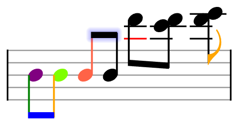

All of the elements of a note -- its beam, stem, notehead(s), flag, and even ledger lines -- can be styled individually or together, through the various `setStyle` methods on a `StaveNote` object.

* `StaveNote.setStyle(styleObject)` will style all elements of the note (except ledger lines)
* `StaveNote.setKeyStyle(keyIndex, styleObject)` will style a particular notehead ('key' in VexFlow terminology). Keys are always counted 0-based from the lowest to highest notehead.
* `StaveNote.setStemStyle(styleObject)` will style the stem.
* `StaveNote.setFlagStyle(styleObject)` will style the flag.
and `StaveNote.setLedgerLineStyle(styleObject)` will style any ledger lines, if the note has them.

The styleObject is an object with any of these properties:
- fillStyle: the color of the fill (e.g. inner part of a notehead), in the form of a CSS accepted color value.
- strokeStyle: the color of the line strokes (e.g. the stem of a note)
- shadowColor: the color of a note's shadow
- shadowBlur: the blur radius of the shadow, in pixels, passed as an integer.

So, if we wanted to style all of a note we could do this:
``` javascript

// use StaveNote.setStyle() to color all noteheads, the stem, and flag:
var C7 = new Vex.Flow.StaveNote({ keys: ['C/4', 'E/4', 'G/4', 'Bb/4'], duration: '8'});
C7.setStyle({fillStyle: "blue", strokeStyle: "blue"});
```

Or if we wanted to just color one notehead of a `StaveNote` we'd do this:
``` javascript
// use StaveNote.setKeyStyle(keyIndex, styleObject) to style an individual notehead.
// in this example, we use keyIndex = 2, referring to the key "A/4"
var FMaj = new Vex.Flow.StaveNote({ keys: ['C/4', 'F/4', 'A/4'], duration: '8'});
FMaj.setKeyStyle(2, {shadowColor: "yellow", shadowBlur: 3});
```

If we wanted to be really fancy and do this:


We would use this code:
``` javascript
var notes = [
  // Beam
  { keys: ['b/4'], duration: '8', stem_direction: -1 },
  { keys: ['b/4'], duration: '8', stem_direction: -1 },
  { keys: ['b/4'], duration: '8', stem_direction: 1 },
  { keys: ['b/4'], duration: '8', stem_direction: 1 },
  { keys: ['d/6'], duration: '8', stem_direction: -1 },
  { keys: ['c/6', 'd/6'], duration: '8', stem_direction: -1 },
  { keys: ['d/6', 'e/6'], duration: '8', stem_direction: -1 },
];

var stave_notes = notes.map(function(note) { return new VF.StaveNote(note); });
stave_notes[0].setStemStyle({ strokeStyle: 'green' });
stave_notes[1].setStemStyle({ strokeStyle: 'orange' });
stave_notes[1].setKeyStyle(0, { fillStyle: 'chartreuse' });
stave_notes[2].setStyle({ fillStyle: 'tomato', strokeStyle: 'tomato' });

stave_notes[0].setKeyStyle(0, { fillStyle: 'purple' });
stave_notes[4].setLedgerLineStyle({ fillStyle: 'red', strokeStyle: 'red' });
stave_notes[6].setFlagStyle({ fillStyle: 'orange', strokeStyle: 'orante' });

var beam1 = new VF.Beam([stave_notes[0], stave_notes[1]]);
var beam2 = new VF.Beam([stave_notes[2], stave_notes[3]]);
var beam3 = new VF.Beam(stave_notes.slice(4, 6));

beam1.setStyle({
  fillStyle: 'blue',
  strokeStyle: 'blue',
});

beam2.setStyle({
  shadowBlur: 20,
  shadowColor: 'blue',
});

VF.Formatter.FormatAndDraw(ctx, stave, stave_notes, false);

beam1.setContext(ctx).draw();
beam2.setContext(ctx).draw();
beam3.setContext(ctx).draw();
```