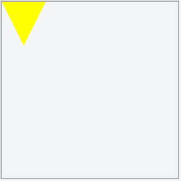
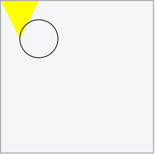
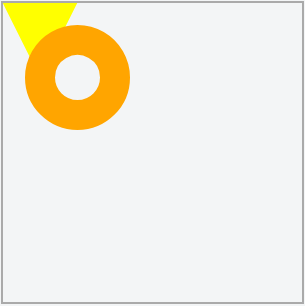
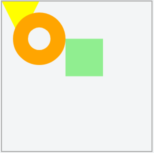
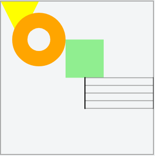

Almost every VexFlow example starts with the same five lines of code. Those of us who use VexFlow regularly have them memorized:
``` JavaScript
VF = Vex.Flow;
var div = document.getElementById("boo")
var renderer = new VF.Renderer(div, VF.Renderer.Backends.SVG);
renderer.resize(200, 200);
var context = renderer.getContext();
```
These five lines set up the space where we'll render the music, and create the `context` object that will do the drawing. Let's take a deep dive into them to really start to understand how VexFlow's rendering mechanism works.

## Understanding the Boilerplate

First we make a shortcut to the complete VexFlow library, calling it VF. You don't need this, you can type Vex.Flow every time. But we promise VF will be much more comfortable in the long run.
``` JavaScript
var VF = Vex.Flow;
```

The next line gets a reference to the div that will hold our svg, where the music will be rendered:
``` JavaScript
var div = document.getElementById("boo")
```

Up next is where the magic starts to happen. First we make a `renderer`. 

A `renderer` in VexFlow actually doesn't do much real rendering. It's main job is to create a `context` -- which you'll soon see is the most important character in this story. The renderer also creates a few shared methods to make it possible for the two very different types of contexts (SVG & Canvas) to use the same API. But once you've created a renderer and set up a size for your music, you'll rarely reference it again.

> A `renderer` creates the `context` for you and sizes the available drawing space. It does not actually render anything itself.

We pass the `Renderer` class constructor two arguments.
- 1. The div in which we'll render our SVG.
- 2. A number representing the kind of `context` we want to create. SVG is 3. Canvas is 1. But who wants to remember that?
 They're saved in the codebase as variables to make things easier: `VF.Renderer.Backends.SVG` and `VF.Renderer.Backends.CANVAS`. (They're in CAPS because they're meant to be CONSTANTS.)

``` JavaScript
var renderer = new VF.Renderer(div, VF.Renderer.Backends.SVG);
// is equivalent to:
var renderer = new VF.Renderer(div, 3);
```

Now we have a renderer. We'll do two things with it, first tell it how big we want our svg to be:
``` JavaScript
//             (width, height)
renderer.resize(200,   200);
```
And, critically, we'll ask it to give us the `context` it created. Remember we passed our renderer the number 3 for S-V-G. (Ok, that's not really why it's 3, but it makes it easy to remember.) That line of code told the `renderer` to make an `SVGContext` for us. And here, we ask the renderer to give that context to us so that we can use it when we need to draw things:

``` JavaScript
var context = renderer.getContext();
```
Tada! That was the real goal of these five lines of code. Let's take a second to note that our `context` is an instance of `SVGContext`:
``` JavaScript
console.log(`context is an instance of: ` + context.constructor.name); // "Context is an instance of SVGContext"
```
And its code can be found in svgcontext.js.

## Using a `context`

But, what is a `context` anyway?

A `context` in VexFlow terminology is the class that you use to draw the music. You can either do it on an [HTML Canvas](https://developer.mozilla.org/en-US/docs/Web/API/Canvas_API/Tutorial) using VexFlow's `CanvasContext`. Or, by default, you can do it on an [SVG](https://developer.mozilla.org/en-US/docs/Web/SVG/Tutorial) using VexFlow's `SVGContext`. Everything that needs to draw in VexFlow uses one of these contexts. You'll see things like `voice.draw(context, stave)` or `noteHead.setContext(context).draw()` sprinkled throughout the codebase.

> Remember: `context`'s job is to draw, and anything that needs to be drawn needs `context`'s help to do it.

An `SVGContext` (or `CanvasContext` if you passed in `1` to the renderer) contains all of the classic drawing tools. Methods for drawing lines, rectangles, circles, polygons, text, etc... It does all the heavy lifting of translating shapes into SVG code (or an HTML Canvas) for us.

If you've followed this far (congratulations), we're ready to explore drawing with `context` which, in addition to giving you an idea of how everything in VexFlow is drawn, turns out to be really fun. (It's basically [LOGO](https://en.wikipedia.org/wiki/Logo_(programming_language)#Turtle_and_graphics) for adults.)

These next steps can be followed in this [jsfiddle](https://jsfiddle.net/gristow/r21r2kea/).

The basic paradigm of a `context` is to move a `pen` from point to point, creating a path. We can then either trace the outline of the path with a `stroke()`, or if we've created an enclosed space (say, a polygon) with our path, we can `fill()` it. For ease, these drawing commands are chainable.

First, we have to tell our `context` to start recording our moves, by beginning a path. Let's draw and fill a triangle to get started:
``` JavaScript
context.beginPath() // start recording our pen's moves
  .moveTo(0, 0) // pickup the pen and set it down at X=0, Y=0. NOTE: Y=0 is the top of the screen.
  .lineTo(50, 0) // now add a line to the right from (0, 0) to (50, 0) to our path
  .lineTo(25, 50) // add a line to the left and down from (50, 0) to (25, 50)
  .closePath() // now add a line back to wherever the path started, in this case (0, 0), closing the triangle.
  .fill({ fill: 'yellow' }); // now fill our triangle in yellow.
```


Pretty cool, right?

If you take a look at the code in svgcontext.js, you'll see that these human-readable instructions are being translated to a slightly more arcane set of instructions that will go in the SVG. (In this case `M0 0L50 0L25 50Z`.)

Now let's draw a circle -- but not fill it:
``` JavaScript
context.beginPath()
  //  (x_center, y_center, radius, starting_angle, ending_angle, counterclockwise?)
  .arc(50,       50,       25,     0,              2*Math.PI,  false)
  .stroke();
```


That's nice and all, but what if we wanted it to be more colorful? Let's delete it -- an SVG shares many of the methods and properties that any other HTMLElement has, including 'removeChild' and 'lastChild'. Our `svg` element is at `context.svg`:
``` JavaScript
context.svg.removeChild(context.svg.lastChild);
```
We don't have to give `context` instructions for the circle again. It will remember the path we were working on until we call `beginPath()` again. So, let's make our circle thicker & more colorful, like a Halloween donut. Then we'll just call 'stroke()' again.

``` JavaScript
context.save(); // save the prior style so we can come back to it.
context.setStrokeStyle('orange');
context.setLineWidth(20);
context.stroke();
context.restore(); // restore the prior style, so our stave's lines aren't thick and orange. 
```


The two rectangle methods, `rect` and `fillRect` are special. They will draw directly to the canvas without your having to call `stroke()` or `fill()`.

``` JavaScript
//          (x,  y,  w,  h,  attributes )
context.rect(85, 50, 50, 50, { fill: 'lightgreen' });
```
Which is equivalent to:
``` JavaScript
context.save();
context.setFillStyle('lightgreen');
context.setStrokeStyle('none');
context.fillRect(85, 50, 50, 50);
context.restore();
```


And we're practically on our way to being [Piet Mondrian](https://en.wikipedia.org/wiki/Piet_Mondrian). If he had liked circles, triangles, or anything other than primary colors.

## Can we draw some music now???

So how does this all play out with musical notation? VexFlow has objects representing almost all of the elements of notation. When we construct an element, we give it the musical information it needs to know how to render, and then later we share (or its parent element shares) a context with it so that it can draw itself.

The easiest example of this to understand is a staff. All it needs to know is where it goes, and how wide it should be:
``` JavaScript
                        (x,   y,  width)
var stave = new VF.Stave(110, 60, 90);
```
Perfect, let's draw it!
``` JavaScript
stave.draw(); // RuntimeError: NoContext -- No rendering context attached to instance
```
Woops! Why couldn't the stave draw itself? Because it didn't have access to all of the wonderful drawing methods that a `context` provides. Let's give it what it needs, and try that again:
``` JavaScript
stave.setContext(context).draw();
```


Ahhh, perfect, we're well on our way to designing a children's piano method book.

Though you may never need to work directly with the methods in a `context`, everything you do with VexFlow will involve one. And now, each time you see VexFlow render notation, you'll know what's really happening.

And all that potential is encapsulated in those first five memorizable lines of code:
``` JavaScript
var VF = Vex.Flow;
var div = document.getElementById('boo');
var renderer = new VF.Renderer(div, 3);
renderer.resize(500, 200);
var context = renderer.getContext();
```